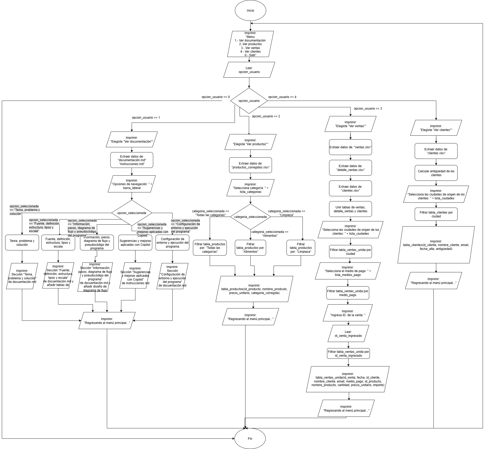

# Documentación del proyecto: Tienda Aurelion

## Tema, problema y solución

**Tema:** Análisis interactivo de ventas y clientes mediante una aplicación web.

**Problema:** La empresa necesita una forma sencilla y centralizada de visualizar la información de ventas, productos y clientes sin tener que usar múltiples hojas de Excel.

**Solución:** Desarrollo de una aplicación en Streamlit que integre las 4 bases de datos y permita consultar la información desde un panel interactivo.

## Fuente, definición, estructura, tipos y escala

**Fuente:** El origen de datos es secundario en archivos de Excel (son datos generados con fines educativos).
Generados por el profesor y el equipo los recibe como datos secundarios.

**Definición:** Las bases de datos pertenecen a una tienda llamada “Aurelion”, la información está compuesta por varias tablas con datos sobre las ventas, detalle de ventas, productos y clientes de la tienda.

**Estructura:** los datos de las 4 bases recibidas, son datos estructurados y están en formato de tabla en un archivo Excel (.xlsx). A continuación se encuentra un análisis de los datos en las tablas:

### Tabla "clientes"

| Campo             | Tipo        | Escala    |
|-------------------|-------------|-----------|
| `id_cliente`      | int         | Nominal   |
| `nombre_cliente`  | string      | Nominal   |
| `email`           | string      | Nominal   |
| `ciudad`          | string      | Nominal   |
| `fecha_alta`      | string/date | Intervalo |

### Tabla "detalle_Ventas"

| Campo             | Tipo        | Escala    |
|-------------------|-------------|-----------|
| `id_venta`       | int         | Nominal   |
| `id_producto`     | int         | Nominal   |
| `nombre_producto` | string      | Nominal   |
| `cantidad`        | int         | Razón     |
| `precio_unitario` | int         | Razón     |
| `importe`         | int         | Razón     |

### Tabla "productos"

| Campo             | Tipo        | Escala    |
|-------------------|-------------|-----------|
| `id_producto`     | int         | Nominal   |
| `nombre_producto` | string      | Nominal   |
| `categoria`       | string      | Nominal   |
| `precio_unitario` | int         | Razón     |

### Tabla "ventas"

| Campo             | Tipo        | Escala    |
|-------------------|-------------|-----------|
| `id_venta`        | int         | Nominal   |
| `fecha`           | string/date | Intervalo |
| `id_cliente`      | int         | Nominal   |
| `nombre_cliente`  | string      | Nominal   |
| `email`           | string      | Nominal   |
| `medio_pago`      | string      | Nominal   |

## Información, pasos, diagrama de flujo y pseudocódigo del programa

**Pasos principales:**

1. Cargar los archivos Excel.

2. Unificar las bases con merge() para relacionar ventas con clientes y detalle de ventas.

3. Mostrar los datos en diferentes páginas del menú (productos, ventas, clientes).

4. Permitir filtrado por ciudad, categoría o método de pago. Esto se realiza de acuerdo al botón del menú principal seleccionado.

5. Mostrar resultados con tablas interactivas.

**Pseudocódigo:**

```pseudocode
Inicio
Mostrar menú principal con botones
│
Si usuario elige “Ver productos”:
    Extraer productos.xlsx
    Mostrar lista filtrable de los productos por categoría
    Filtrar tabla de acuerdo con la selección del usuario
    Mostrar tabla filtrada
    Regresar al menú principal
│
Si usuario elige “Ver ventas”:
    Extraer ventas.xlsx, clientes.xlsx y detalle_ventas.xlsx
    Mostrar lista filtrable de las ventas por ciudad, medio de pago y ID de Venta.
    Filtrar tabla de acuerdo con las selecciones del usuario
    Mostrar tabla filtrada
    Regresar al menú principal
│
Si usuario elige “Ver clientes”:
    Extraer clientes.xlsx
    Calcular antigüedad
    Mostrar lista filtrable de los clientes por ciudad
    Filtrar tabla de acuerdo con la selección del usuario
    Mostrar tabla filtrada
    Regresar al menú principal
└─ Fin
```

**Diagrama de flujo:**


[Presione aquí](https://github.com/MartinOtamendiT/Aurelion/blob/main/Aurelion_diagrama_flujo.png) para ver el diagrama, en caso de tener problemas con la visualización.

## Sugerencias y mejoras aplicadas con Copilot

* Corrección de información de la base de datos de productos.xlsx, de la variable de categorias original, agregando una columna de categoria_corregida en un nuevo archivo productos_corregidos.xlsx. En esta nueva BD están los productos clasificados correctamente como Alimentos o Limpieza.

* Generar automáticamente funciones para cada vista (see_products, see_clients, see_sales). (Sugerencia interna del equipo)

* Sugerir estructuras de selectbox, multiselect y button según el contexto. (Revisión con el equipo para seleccionar las más adecuadas)

* Autocompletar el código de extracción y modificación de datos (pd.read_excel) y el merge de DataFrames, en el caso de la pestaña de ventas.

* Mejorar la legibilidad del pseudocódigo y la navegación con st.session_state.

* Mejoras para la documentación del archivo README.md

Nota: Algunas sugerencias fueron realizadas por el asistente de autocompletado de código de Copilot.

## Configuración de entorno y ejecución del programa

En esta sección se detallan los pasos necesarios para configurar el entorno y ejecutar la aplicación web interactiva desarrollada con **Streamlit** y **Python**.

### Requisitos Previos

Asegúrate de tener instalado lo siguiente en tu sistema:

* **Python 3.11+**: La aplicación está diseñada para ejecutarse con versiones modernas de Python.
* **Pip** (administrador de paquetes de Python): Generalmente viene incluido con las instalaciones de Python.

---

### Configuración del Entorno

Sigue estos pasos para preparar tu entorno de desarrollo:

#### 1. Clonar o Descargar el Repositorio

Abre tu terminal y utiliza el siguiente comando para clonar el repositorio si estás utilizando Git:

```bash
git clone <URL_DEL_REPOSITORIO>
```

De lo contrario, simplemente descarga los archivos del proyecto y abre tu terminal para moverte al mismo directorio con el siguiente comando:

```bash
cd <NOMBRE_DEL_DIRECTORIO>
```

#### 2. Crear un Entorno Virtual dentro de la carpeta (Recomendado)

Es una práctica estándar aislar las dependencias del proyecto utilizando un entorno virtual. Crealo dentro del directorio del proyecto.

```bash
python -m venv .venv
```

Activa el entorno virtual de la siguiente forma:

* En Linux/macOS:

    ```bash
    source .venv/bin/activate
    ```

* En Windows:

    ```bash
    .venv\Scripts\activate
    ```

#### 3. Instalar Dependencias

Todas las bibliotecas necesarias (incluyendo Streamlit) deben instalarse con el siguiente comando y el archivo "requirements.txt":

```bash
pip install -r requirements.txt
```

### Ejecución de la aplicación

#### 1. Comando de ejecución

Asegúrate de que el entorno virtual esté activo y/o las librerías estén instaladas. Ejecuta el archivo principal de la aplicación (main.py):

```bash
streamlit run app.py
```

#### 2. Acceso a la aplicación

Al ejecutar el comando, Streamlit iniciará un servidor web local y automáticamente abrirá la aplicación en tu navegador predeterminado.

En caso de que no se abra automáticamente, puedes acceder a ella manualmente a través de la siguiente dirección: `http://localhost:8501`

**Nota**: El puerto predeterminado de Streamlit es 8501. Si ese puerto está ocupado, Streamlit te informará de un puerto alternativo que esté utilizando.

#### 3. Detener la Ejecución
Para detener la aplicación, simplemente vuelve a la terminal donde se está ejecutando el comando streamlit run y presiona:
 
* Windows/Linux:

    ```bash
    Ctrl + C
    ```

* MacOs:

    ```bash
    Cmd + C
    ```
